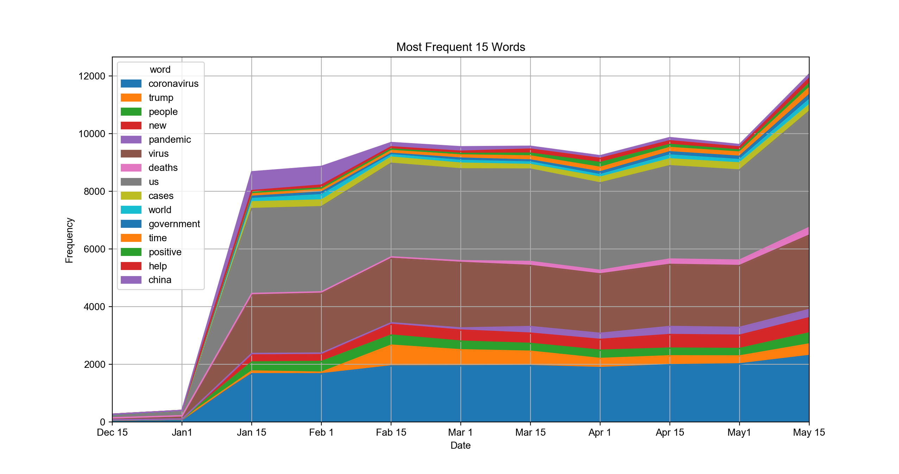
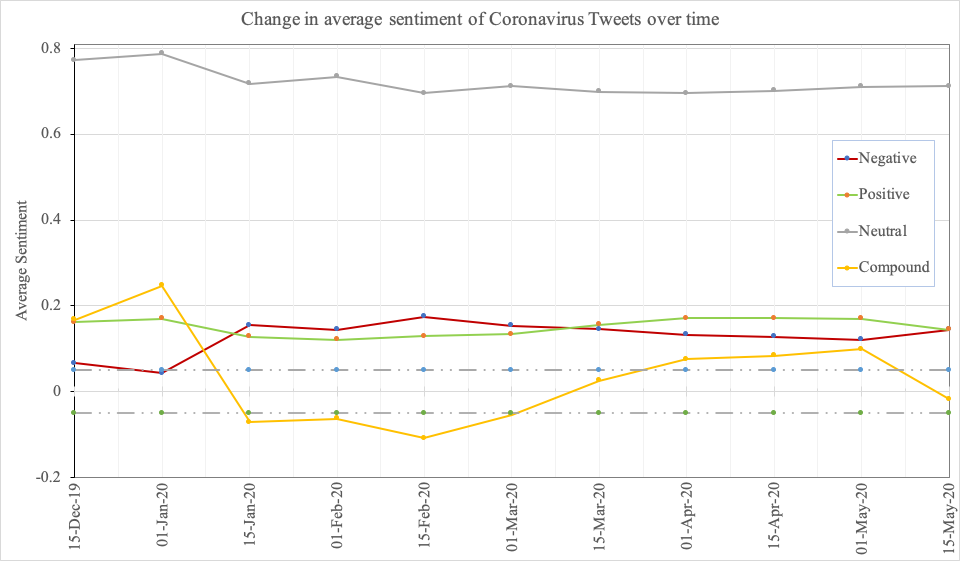
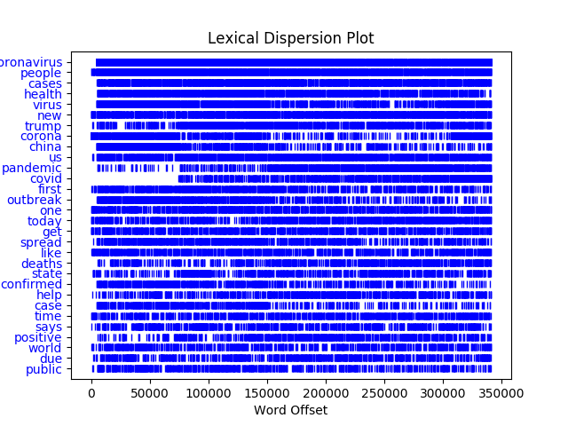

# Diachronic Semantic Change in Tweets About COVID-19: An NLP Based Frequency and Sentiment Analysis

This program diachronically analyzes semantic patterns in frequency, sentiments and word vector embeddings. To achieve this, I used different methods of Natural Language Processing (NLP) such as word vectors, sentiment analysis using a Naïve Bayesian Classifier and word frequency analysis. The data consists of 22834 Tweets, 75937 tokens and 346,025 words in the corpus.

*Keywords*: “coronavirus”, “corona”, “COVID”, “COVID-19” 

## Install Requirements

`pip3 install -r requirements.txt`

### How to run

```bash
python3 analysis.py
```
This will generate the processed data and corpus from raw Twitter data.
All the analyzed data, graphs and tables will be saved in "data/tables/" and "results/" directories.

If you would like to regenerate the data run with the `--process_data` flag.

You can also run the program with the `--analyze_data` flag, which will generate the frequency graphs and word vectors. This might take a while to run since the Word2Vec model will be training.

### Example Results



 

